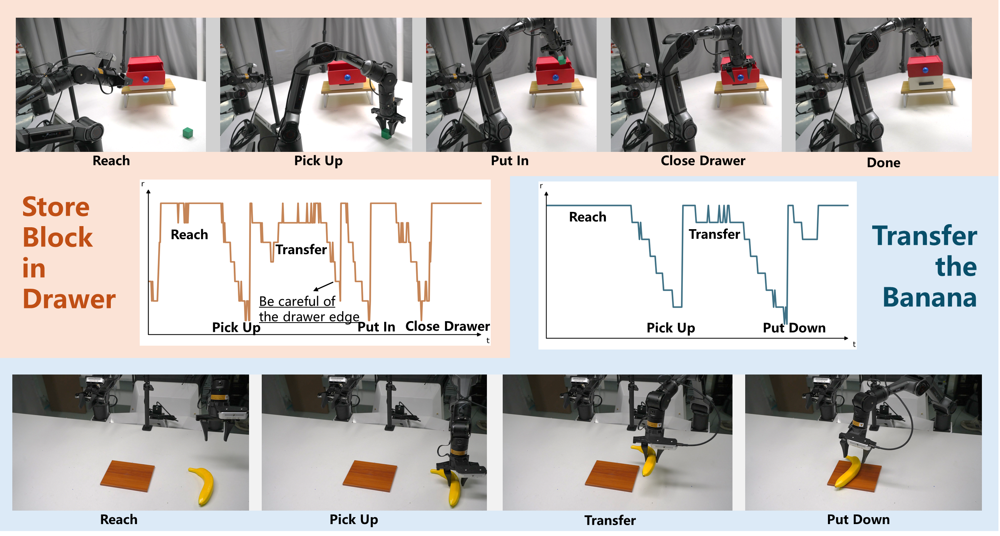
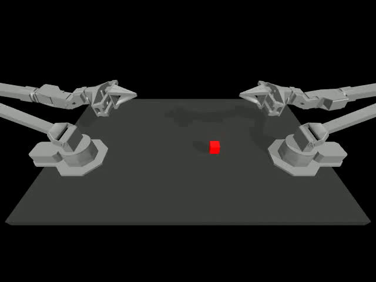
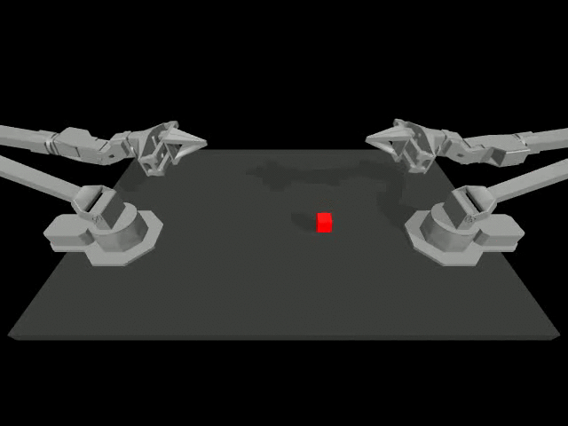
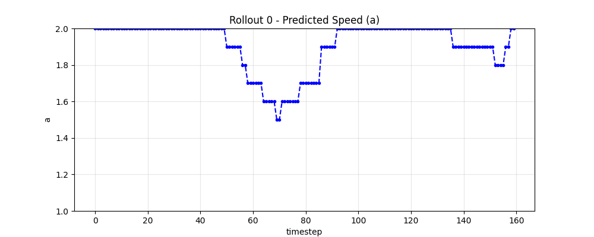

The corresponding experiment videos and more details are available at: [Project Page](https://zihengqiu.github.io/AutoSpeed/)
## 1 Introduction

**AutoSpeed** is a model-agnostic learning framework that enables existing visuomotor policies to predict trajectories with stage-adaptive motion speeds, without requiring speed or stage annotations. 

[26-06-20] "AutoSpeed: Annotation-Free Stage-Adaptive Motion Speed Learning for Robot Manipulation" has been accepted by European Conference on Computer Vision (ECCV) 2026.

[26-07-02] We have open-sourced the core code required for AutoSpeed training, so you can try integrating it into your own codebase. Recommend: [ACT](https://github.com/tonyzhaozh/act) [BAKU](https://github.com/siddhanthaldar/BAKU/tree/main)

[26-07-05] We have open-sourced the core code and some pretrained checkpoints in our real-world experiments. See in [real-world guidance](./example/autospeed_cobot_magic/README.md) or the following chapters.

[26-07-06] We have open-sourced the core code and some pretrained checkpoints in our simulation experiments. See in [simulation guidance](./example/autospeed_simulation/README.md) or the following chapters.


## 2 Codebase Structure

### 2.1 All-in-One Server

AutoSpeed is a plug-and-play training scheme that can be applied to various non-generative and generative embodied manipulation policies. To make it easier to use, we have reorganized the development code and refactored AutoSpeed into an **independent server class**, integrating its core functionalities into `./agent/autospeed_server.py`. This allows you to quickly deploy AutoSpeed in the training pipelines of different policies.

### 2.2 Implementation Examples
The `example` folder provides examples of the policies and environments that we have already adapted.

## 3 Real-World Effect Demonstration

<p align="center">
  <a href="https://zihengqiu.github.io/AutoSpeed/">
    
  </a>
</p>

<p align="center">
  <a href="https://zihengqiu.github.io/AutoSpeed/">
    ▶ Watch full experiment videos
  </a>
</p>

<p align="center">
    
</p>

## 4 Simulation Effect Demonstration

### Original rollout:

<p align="center">
    
</p>


### AutoSpeed rollout:
<p align="center">
    
</p>

### Predicted speed curve:
 
<p align="center">
    
</p>


## 5 AutoSpeed Simulation Implement Guidance
### 5.1 Preparation

Install the dependencies required by the target simulator before running its scripts. CleanDiffuser is used by the action heads:

```bash
cd example/autospeed_simulation
mkdir -p repos
git clone https://github.com/CleanDiffuserTeam/CleanDiffuser.git repos/CleanDiffuser
```

Download the DINOv2 code and weights for config `encoder_type: dino`:

```text
weights/dinov2/
weights/dinov2_weight/dinov2_vitb14_reg4_pretrain.pth
```

Download the language encoder from [all-MiniLM-L6-v2](https://huggingface.co/sentence-transformers/all-MiniLM-L6-v2) when task embeddings need to be generated.

Set the data roots as needed:

```bash
export AUTOSPEED_ROOT=$(pwd)
export ALOHA_SIM_DATA_DIR=data/alohasim
export LIBERO_DATA_DIR=data/libero
export METAWORLD_DATA_DIR=data/metaworld
```

### 5.2 Training

```bash
python scripts/train_alohasim.py
python scripts/train_libero.py
python scripts/train_metaworld.py
```

### 5.3 Evaluation

```bash
python scripts/eval_alohasim.py --ckpt-path checkpoints/<run>/snapshot/<step>.pt
python scripts/eval_libero.py --ckpt-path checkpoints/<run>/snapshot/<step>.pt
python scripts/eval_metaworld.py --ckpt-path checkpoints/<run>/snapshot/<step>.pt
```

### 5.4 AlohaSim high-gain controller

`scripts/eval_alohasim.py` enables the AlohaSim speedup setting by default:

```bash
EVAL_SPEEDUP=true python scripts/eval_alohasim.py --ckpt-path checkpoints/<run>/snapshot/<step>.pt
```

Set `EVAL_SPEEDUP=false` to evaluate with the normal controller XML:

```bash
EVAL_SPEEDUP=false python scripts/eval_alohasim.py --ckpt-path checkpoints/<run>/snapshot/<step>.pt
```

`EVAL_SPEEDUP` is passed to `make_sim_env(task_name, speedup)`. When it is enabled, the simulator loads the high-gain MuJoCo XML files instead of the normal XML files under `/suite/act/assets/`. This increases the gripper actuator gain so that open/close commands respond faster and with stronger tracking during evaluation.


### 5.5 Pretrained Checkpoints
We have prepared some pretrained checkpoints in the AlohaSim publicly available for the community to use.
You can download it here. [[Pretrained Checkpoints]](https://huggingface.co/Telon1/autospeed_alohasim_ckpt)


## 6 Autospeed Real-World Implement Guidance

### 6.1 Preparation
```python
cd example/autospeed_cobot_magic/repos
git clone https://github.com/CleanDiffuserTeam/CleanDiffuser.git
```

The language encoder is available at [[all-MiniLM-L6-v2]](https://huggingface.co/sentence-transformers/all-MiniLM-L6-v2).

### 6.2 Training
```python
python example/autospeed_cobot_magic/scripts/train.py
```

### 6.3 Real Robot Inference
```python
python example/autospeed_cobot_magic/scripts/inference.py
```

### 6.4 Pretrained Checkpoints
We have made the real-robot checkpoints trained on the cobot magic dual-arm platform publicly available for the community to use.
You can download it here. [[Pretrained Checkpoints]](https://huggingface.co/Telon1/autospeed_cobot_magic_ckpt)


## 7 Acknowledgements and Code References

This repository builds upon and refers to several excellent open-source projects. We sincerely thank the authors of the following repositories for releasing their code and contributing to the robotics and decision-making research community:

* [ACT](https://github.com/tonyzhaozh/act): simulation baseline.
* [BAKU](https://github.com/siddhanthaldar/BAKU): parts of our policy implementation, training pipeline, and experimental code structure are adapted from or inspired by this repository.
* [CleanDiffuser](https://github.com/CleanDiffuserTeam/CleanDiffuser): parts of our diffusion-related implementation and training utilities are adapted from or inspired by this modular diffusion-model codebase.
* [COCOS](https://github.com/ZibinDong/cocos): parts of our diffusion-related implementation and training utilities are adapted from or inspired by this modular diffusion-model codebase.
* [LIBERO](https://github.com/Lifelong-Robot-Learning/LIBERO): our simulated manipulation experiments and evaluation protocols are built on or reference this lifelong robot learning benchmark.
* [MetaWorld](https://github.com/Farama-Foundation/Metaworld): our multi-task manipulation experiments and evaluation environments are built on or reference this benchmark suite.